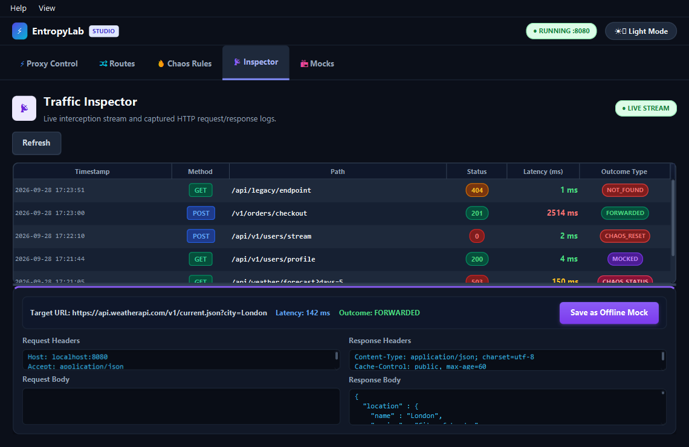
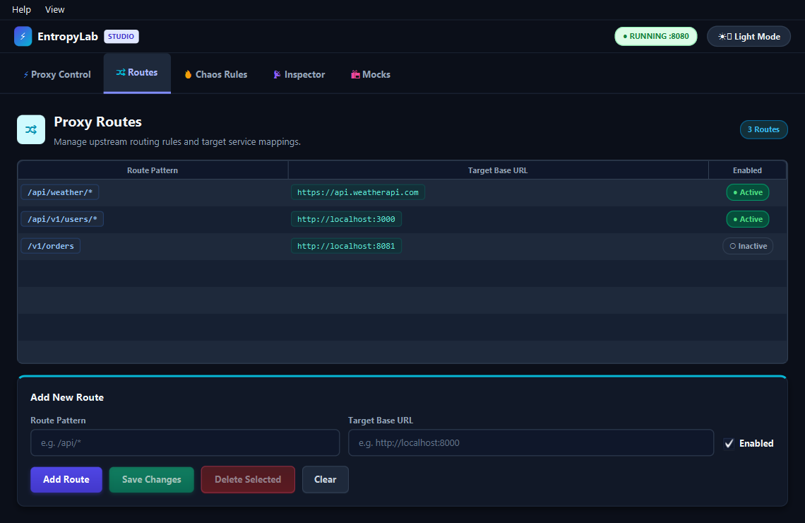
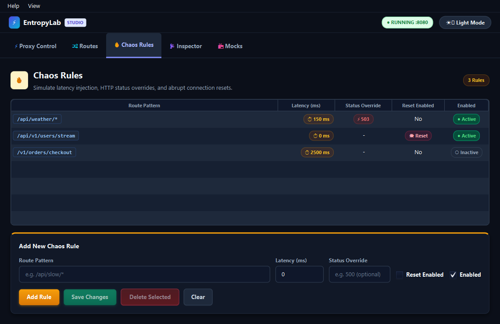
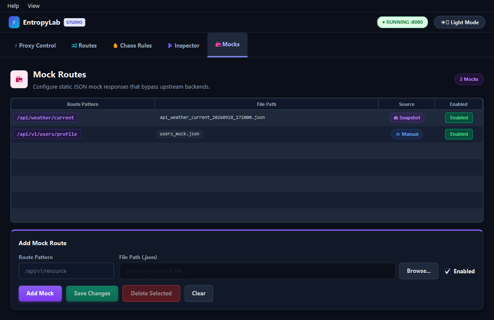
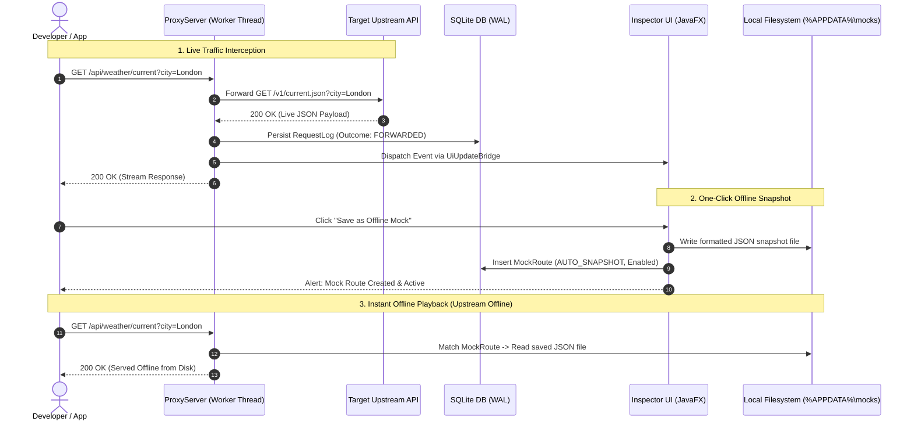
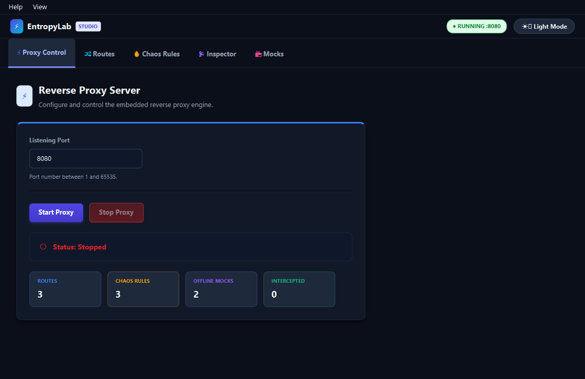
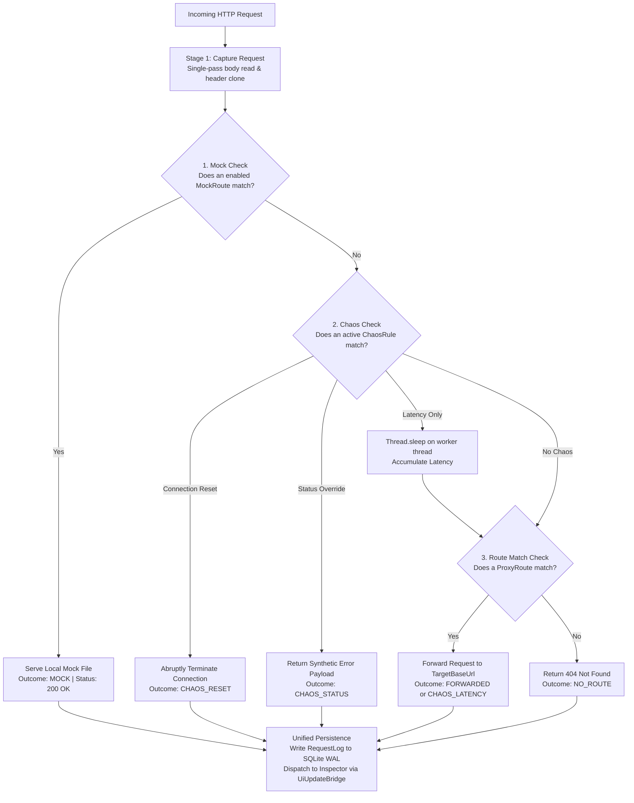
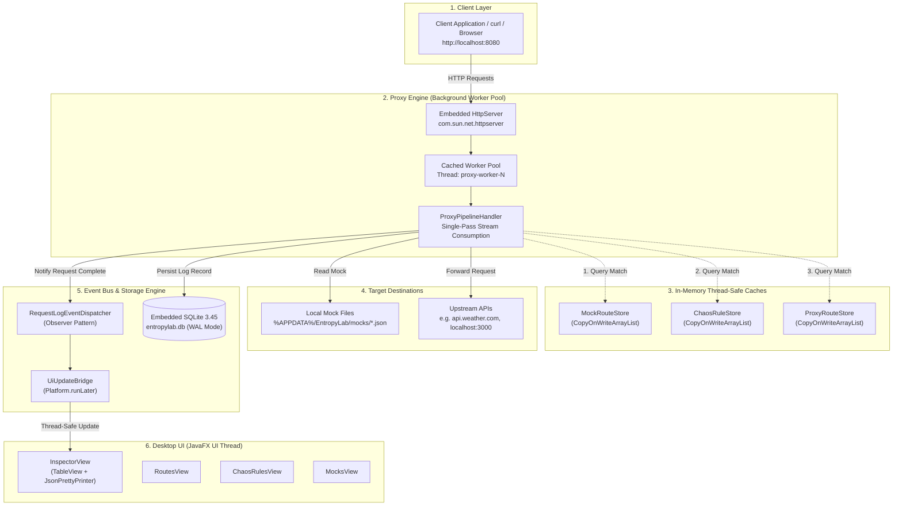
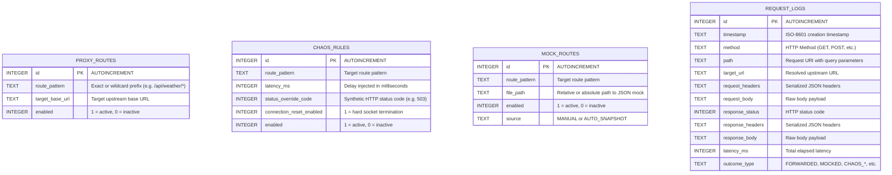

<div align="center">

# ⚡ EntropyLab

**A local API reverse proxy, chaos engineering sandbox, and traffic inspector for modern application developers.**

[](https://openjdk.org/)
[](https://openjfx.io/)
[](https://sqlite.org/)
[](https://microsoft.com/windows)
[](#license)

</div>

<p align="center">
  
</p>

---

## 📖 Overview

**EntropyLab** is a native desktop developer tool designed to eliminate the friction of building, debugging, and testing resilient applications against third-party or internal HTTP APIs. 

Instead of configuring heavy proxy servers, writing mock services from scratch, or wondering how your application reacts when downstream APIs fail or lag, EntropyLab gives you a lightweight, zero-configuration local reverse proxy that can:
- Intercept and forward live HTTP traffic to any upstream target.
- Inject controlled chaos (latency delays, synthetic HTTP error status codes, and abrupt connection resets) on a per-route basis.
- Record all HTTP exchanges in real time to an indexed, embedded SQLite database.
- Inspect request and response headers, payloads, and formatted JSON bodies.
- Snapshot live API responses and turn them into offline mocks with a single click.

EntropyLab runs locally on your machine with zero external service dependencies. All configuration, logs, and mocks persist in an embedded SQLite database (`entropylab.db`) running in high-performance Write-Ahead Logging (WAL) mode.

---

## 🎯 Key Features

### ⚡ 1. Embedded HTTP Reverse Proxy & Dynamic Routing
- Built on a dedicated multi-threaded worker pool (`proxy-worker-*`) that keeps the UI responsive even under heavy traffic or extended chaos sleep states.
- Configurable listen port (default `:8080` or any custom port) with one-click Start and Stop controls.
- Dynamic route mapping: configure multiple source route patterns and forward requests to distinct target base URLs (e.g., `http://localhost:3000`, `https://api.example.com`).
- Pattern matching engine supporting exact path matches (e.g. `/api/v1/auth`) and wildcard prefixes (e.g. `/api/weather/*` or `/v2/*`).
- Preserves full path suffixes and URL query parameters when forwarding to upstream targets.
- Filters hop-by-hop headers (`Host`, `Connection`, `Transfer-Encoding`, etc.) to prevent proxy protocol anomalies.

<p align="center">
  
</p>

### 🔥 2. Chaos Engineering Studio
Test your frontend and backend error boundaries, retries, circuit breakers, and timeouts before pushing code to production:
- **Artificial Latency Injection:** Introduce millisecond delays (e.g. `200ms`, `2500ms`) to simulate slow 3G/4G connections, database contention, or backend bottlenecks. Latency sleeps run strictly on isolated worker threads.
- **Status Code Overrides:** Return synthetic HTTP status codes (e.g. `400 Bad Request`, `401 Unauthorized`, `404 Not Found`, `429 Too Many Requests`, `500 Internal Server Error`, `503 Service Unavailable`) with synthetic JSON fault payloads without hitting the upstream server.
- **Connection Resets:** Abruptly terminate client connections to simulate network drops, socket timeouts, and crashed backends.
- **Route-Independent Faults:** Chaos rules evaluate independently of whether an upstream proxy route exists, allowing you to test error handling for upcoming or unreleased APIs.

<p align="center">
  
</p>

### 📦 3. Offline Mocks & One-Click Snapshots
- **Manual Mock Routes:** Register local mock routes backed by `.json` files on your disk.
- **Auto-Mock Snapshot Workflow:** Captured an interesting live API response in the Inspector? Click **"Save as Offline Mock"** to automatically save the response payload to a filesystem-safe JSON file in `%APPDATA%\EntropyLab\mocks\` and register an active mock route.
- **Instant Offline Fallback:** When a mock route is active, EntropyLab serves the local mock response immediately—even if the upstream server is completely unreachable or offline.

<p align="center">
  
</p>



### 📡 4. Real-Time Traffic Inspector & Deep Logging
- Comprehensive event-driven log streaming: see requests stream into the Inspector table the moment they complete.
- Visual status pills for request outcomes:
  - `FORWARDED` — Successfully proxied to upstream and received response.
  - `MOCKED` — Intercepted and served locally from mock snapshot.
  - `CHAOS_LATENCY` — Forwarded after intentional latency injection.
  - `CHAOS_STATUS` — Intercepted with synthetic status code override.
  - `CHAOS_RESET` — Abruptly closed client connection.
  - `NOT_FOUND` — No matching route or mock configured (HTTP 404).
  - `ERROR` — Gateway/network failure (HTTP 502 / 504).
- Detailed side-by-side inspection view:
  - Timestamp, Method, Path, Status Code, Elapsed Latency.
  - Request Headers & Response Headers.
  - Request Body & Response Body.
  - Integrated `JsonPrettyPrinter` to reformat minified JSON into structured, indented trees.

<p align="center">
  
</p>

### 🎨 5. Sleek Desktop UI & Dual Themes
- Native JavaFX desktop application with a clean, modern aesthetic.
- **Dark Mode & Light Mode:** Toggle on-the-fly using the header button or keyboard shortcut (`Ctrl + D`). Theme preference is remembered across application restarts.
- Dynamic window title and header badge showing real-time proxy state (`● RUNNING :port` / `○ STOPPED`).

<p align="center">
  
</p>

---

## 🏛️ Pipeline Precedence & Architecture

When an HTTP request reaches the EntropyLab proxy server, it passes through a deterministic three-tier pipeline:



### Architectural Guarantees
1. **Precedence Hierarchy:** `Mock Routes` > `Chaos Rules` > `Proxy Route Forwarding`. A matched mock route always takes top priority and prevents requests from reaching the upstream server or triggering chaos.
2. **Single-Pass Stream Consumption:** Request body input streams are read to completion exactly once at the entry boundary. The resulting byte array is shared across forwarding, logging, and inspection, avoiding stream exhaustion bugs.
3. **Thread Safety & Non-blocking UI:** Proxy requests execute inside a cached thread pool (`proxy-worker-*`). Heavy network operations or latency injection will never freeze the JavaFX Application Thread.
4. **Unified Asynchronous Persistence:** All requests (successes, mocked, chaos, or failed) exit through a unified `finally` block that writes an indexed `RequestLog` record to SQLite and dispatches updates via `UiUpdateBridge`.

### System Architecture & Threading Model

EntropyLab separates incoming HTTP client execution, background proxy pipelines, asynchronous event dispatching, and desktop UI rendering across isolated threads:



---

## 📂 Project Structure

```
EntropyLab/
├── pom.xml                               # Maven project definition and dependencies
├── dev-run.ps1                           # Fast development compile & run script
├── build-installer.ps1                   # Packaging script for EXE / MSI / App-Image
├── BUILD.md                              # Comprehensive build & jpackage documentation
├── VERIFICATION.md                       # Verification suite report and test checklist
└── src/
    └── main/
        ├── java/com/entropylab/
        │   ├── Launcher.java             # Main-Class bootstrap entrypoint
        │   ├── EntropyLabApp.java        # JavaFX Application lifecycle, layout & tabs
        │   │
        │   ├── chaos/                   # Chaos engineering domain
        │   │   ├── ChaosRule.java        # Entity: latency, status override, reset
        │   │   ├── ChaosRuleDao.java     # SQLite DAO for chaos rules
        │   │   └── ChaosRuleStore.java   # Thread-safe in-memory cache
        │   │
        │   ├── core/                    # Core infrastructure & database
        │   │   ├── AppContext.java       # Dependency injection container & state registry
        │   │   ├── AppPaths.java         # %APPDATA%\EntropyLab paths resolution
        │   │   ├── DatabaseManager.java  # SQLite connection pool & WAL mode
        │   │   ├── RoutePatternMatcher.java # Path matching & longest prefix logic
        │   │   └── SchemaInitializer.java # DDL tables & indexes creation
        │   │
        │   ├── logging/                 # Traffic log domain
        │   │   ├── OutcomeType.java      # FORWARDED, MOCK, CHAOS_*, NO_ROUTE, ERROR
        │   │   ├── RequestLog.java       # HTTP exchange audit entity
        │   │   ├── RequestLogDao.java    # SQLite DAO with pagination & queries
        │   │   └── RequestLogEventDispatcher.java # Observer pattern dispatcher
        │   │
        │   ├── mock/                    # Mocking & auto-snapshotting
        │   │   ├── MockFileNaming.java   # Filesystem-safe timestamped file generator
        │   │   ├── MockRoute.java        # Entity: pattern, file path, source, enabled
        │   │   ├── MockRouteDao.java     # SQLite DAO for mock definitions
        │   │   ├── MockRouteStore.java   # Thread-safe in-memory route cache
        │   │   └── MockSource.java       # MANUAL vs AUTO_SNAPSHOT
        │   │
        │   ├── proxy/                   # Embedded HTTP server & proxy logic
        │   │   └── ProxyServer.java      # Reverse proxy pipeline handler
        │   │
        │   ├── routes/                  # Proxy routing configuration
        │   │   ├── ProxyRoute.java       # Entity: pattern -> target base URL
        │   │   ├── ProxyRouteDao.java    # SQLite DAO for proxy routes
        │   │   └── ProxyRouteStore.java  # Thread-safe in-memory cache
        │   │
        │   └── ui/                      # JavaFX views, controllers & styles
        │       ├── ProxyControlView.java # Server port & start/stop view
        │       ├── RoutesView.java       # Proxy route configuration tab
        │       ├── ChaosRulesView.java   # Fault injection configuration tab
        │       ├── InspectorView.java    # Real-time traffic log & details tab
        │       ├── MocksView.java        # Mock routes manager tab
        │       ├── ThemeManager.java     # Light/Dark mode state & preferences
        │       ├── JsonPrettyPrinter.java# JSON syntax indentation formatter
        │       ├── AlertHelper.java      # Validation alerts & modal helpers
        │       └── UiUpdateBridge.java   # UI-safe bridge for background log events
        │
        └── resources/
            ├── icon.ico                  # Application icon for Windows executable
            ├── icon.png                  # High-resolution application brand icon
            └── styles.css                # CSS styling, tokens, and theme overrides
```

---

## 🛠️ Storage & Data Paths

All data is stored locally in standard OS application folders:

| Component | Windows Location | Purpose |
| :--- | :--- | :--- |
| **App Data Directory** | `%APPDATA%\EntropyLab\` | Root application data folder |
| **Database File** | `%APPDATA%\EntropyLab\entropylab.db` | Embedded SQLite database (routes, chaos rules, mocks, request logs) |
| **Mocks Folder** | `%APPDATA%\EntropyLab\mocks\` | Storage directory for auto-generated JSON snapshots and custom mock files |
| **Custom Home Override** | `-Dentropylab.home=<path>` | VM argument to redirect the data directory for testing or portability |

### Database Schema (SQLite 3.45 WAL)

The local SQLite database (`entropylab.db`) initializes automatically on first run and maintains four core tables:



---

## 🚀 Getting Started

### Prerequisites

Ensure you have the following installed on your machine:
- **Operating System:** Windows 10 or Windows 11 (x64)
- **Java Development Kit:** JDK 17 or JDK 21+ (Ensure `JAVA_HOME` is set)
- **Apache Maven:** Maven 3.8+ (Verify with `mvn -version`)

---

### Running in Development

1. **Clone the repository:**
   ```bash
   git clone https://github.com/jisan-sketch/EntropyLab.git
   cd EntropyLab
   ```

2. **Launch using the PowerShell helper script:**
   ```powershell
   .\dev-run.ps1
   ```

3. **Or launch using Maven directly:**
   ```powershell
   mvn clean compile javafx:run
   ```

4. **Or launch via the standalone bootstrap launcher:**
   ```powershell
   mvn clean compile exec:java -Dexec.mainClass="com.entropylab.Launcher"
   ```

---

## 📦 Building Native Packages & Installers

EntropyLab includes an automated packaging script (`build-installer.ps1`) that utilizes JDK's `jpackage` and the **WiX Toolset (3.11+)** to generate self-contained, native Windows executables and MSI installers.

### One-Click Installer Build
Run the automated script in PowerShell:
```powershell
powershell -ExecutionPolicy Bypass -File .\build-installer.ps1
```

> **Note on WiX Toolset:** If WiX 3.11 is not detected on your machine, `build-installer.ps1` will automatically download and unpack the portable WiX binaries into `%USERPROFILE%\.wix311` without needing administrator permissions.

### Targeted Builds
```powershell
# 1. Build a portable directory containing EntropyLab.exe and bundled JRE
.\build-installer.ps1 -PackageType app-image

# 2. Build a Windows EXE Setup installer (includes directory picker and shortcuts)
.\build-installer.ps1 -PackageType exe

# 3. Build a standard Windows MSI installer package
.\build-installer.ps1 -PackageType msi
```

### Distribution Outputs (`target/dist/`)
- `target/dist/EntropyLab/` — **Self-contained Portable Application**: runs anywhere without needing Java installed on the client machine.
- `target/dist/EntropyLab-1.0.0.exe` — **Windows Setup Bootstrapper**: standard setup installer.
- `target/dist/EntropyLab-1.0.0.msi` — **Windows MSI Package**: enterprise/silent installer.

For in-depth manual `jpackage` instructions, consult [BUILD.md](BUILD.md).

---

## 💡 Quick Walkthrough & Usage Guide

### 1. Start the Proxy Server
1. Navigate to the **Proxy Control** tab.
2. Enter your desired local port (e.g., `8080`).
3. Click **Start Proxy**. The header status badge will switch to `● RUNNING :8080`.

### 2. Configure a Proxy Route
1. Navigate to the **Routes** tab.
2. Click **Add Route**.
3. Set **Route Pattern** (e.g., `/api/weather/*`) and **Target Base URL** (e.g., `https://api.weatherapi.com`).
4. Click **Save Route**. Any request to `http://localhost:8080/api/weather/v1/current.json?q=London` will now be forwarded upstream.

### 3. Inject Chaos
1. Navigate to the **Chaos Rules** tab.
2. Click **Add Rule** and enter a pattern (e.g. `/api/weather/*`).
3. Configure your fault:
   - Enter `1500` under **Latency (ms)** to simulate slow network responses.
   - Enter `503` under **Status Code Override** to simulate temporary service outages.
   - Or toggle **Connection Reset** to test abrupt socket cuts.
4. Toggle **Enabled** to active and click **Save Rule**.
5. Issue an HTTP request; observe the synthetic fault take effect immediately.

### 4. Inspect Requests & Create Offline Mocks
1. Navigate to the **Inspector** tab.
2. Select any request in the real-time table to view its full headers, status code, latency, and formatted JSON body.
3. Click **"Save as Offline Mock"**.
4. EntropyLab saves the response payload to a timestamped `.json` file in `%APPDATA%\EntropyLab\mocks\` and automatically adds an active mock route in the **Mocks** tab.
5. Even if you terminate your backend or disconnect from the internet, requests to that route will now be served locally with HTTP 200 OK.

---

## ⌨️ Keyboard Shortcuts & Tips

- **`Ctrl + D`**: Toggle between Dark Mode and Light Mode.
- **Auto-Scroll**: The Inspector view automatically scrolls to the newest incoming request unless you have selected an earlier row to inspect.
- **Search & Filters**: You can sort and inspect historical records loaded directly from the indexed SQLite database.

---

## 🧪 Verification & Testing

EntropyLab features a clean-machine end-to-end verification suite in `com.entropylab.CleanMachineEndToEndVerification`. It verifies:
- Isolated profile generation and directory creation.
- Database schema and WAL mode initialization.
- Proxy routing, wildcard forwarding, and hop-by-hop header removal.
- All chaos dimensions (latency, status override, connection reset).
- Asynchronous logging and JSON pretty-printing.
- Mock route precedence and offline snapshot recovery.
- Full process restart, state persistence, and native bundle integrity.

To execute the verification suite:
```powershell
mvn clean compile exec:java -Dexec.mainClass="com.entropylab.CleanMachineEndToEndVerification"
```
Refer to [VERIFICATION.md](VERIFICATION.md) for the complete checklist and verification report.

---

## 🤝 Contributing

Contributions, bug reports, and feature requests are welcome!
1. Fork the repository.
2. Create your feature branch (`git checkout -b feature/my-new-feature`).
3. Commit your changes (`git commit -am 'Add some feature'`).
4. Push to the branch (`git push origin feature/my-new-feature`).
5. Open a Pull Request.

---

## 📄 License

This project is licensed under the MIT License — see the [LICENSE](LICENSE) file for details.
